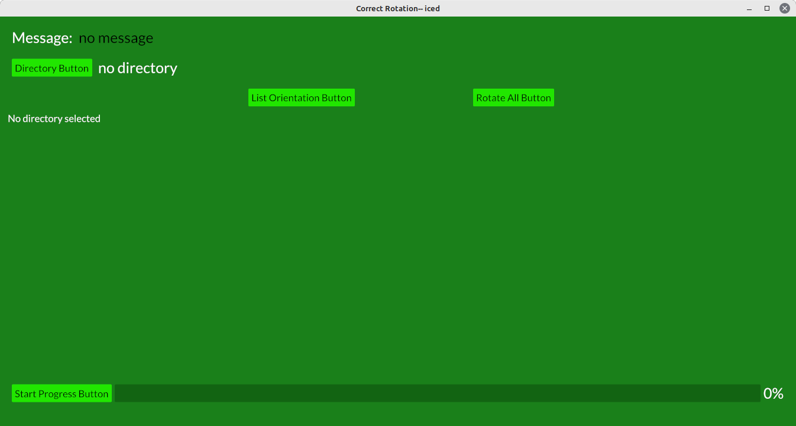

# rotatecorr
Rust-Iced program to correct exif orientation
I converted one function in photorotate180 from using gtk4 to iced.
Iced is still being developed so code may change over time.
This program rotates the image based on exif orientation and sets orientation to 1.

